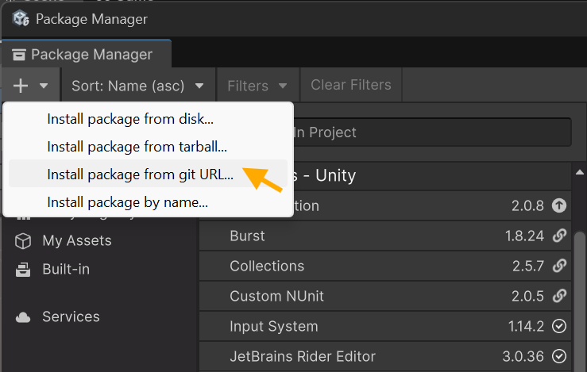

# SimpleUnityHierarchyFolder
Enables the creation of dedicated folder objects in the Unity hierarchy for cleaner, more organized scenes.

Hierarchy Folders are empty GameObjects, but with their transform access removed and represented with a folder icon, making it easy to visually structure large hierarchies.

---

## 📖 About

This Unity package was developed by **Professor Akram Taghavi-Burris** for educational purposes under the **MIT License**.

For more information about the use case for this plugin, visit:  
👉 [https://getcreativetoday.com/](https://getcreativetoday.com/)

---

## ✨ Features

- Create dedicated hierarchy folders directly from the Unity menu.
- Clear folder-style visualization:
  - Game obejct represted by default Unity **folder** icon
  - Colored, all-caps text label
- Hides access to **transform component**, ensuring the folder game object does not affect the scene layout.
- Folder objects can still be turned into prefabs, with a **prefab overlay icon** displayed to visually indicate prefab status.
---

## 📦 Installation (via GitHub URL)

You can add this package directly into your Unity project using the Unity Package Manager:

1. Open Unity.
2. In the top menu, go to: **`Window` > `Package Manager`**.
3. Click the **`+`** button in the top-left corner.
4. Select **`Add package from Git URL...`**
5. Paste the following URL:  

---

## 🚀 Usage

1. In the Unity menu, go to **GameObject → Create Hierarchy Folder**.
2. A new **folder** object will appear in your hierarchy.
3. In the inspector set the name and *text* color of the folder
