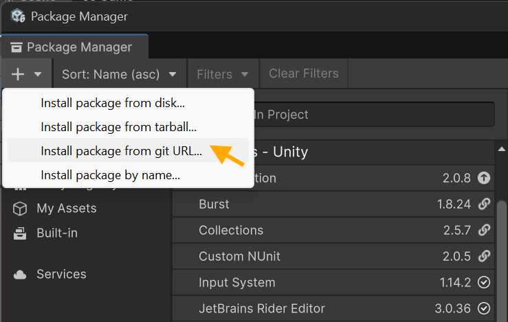
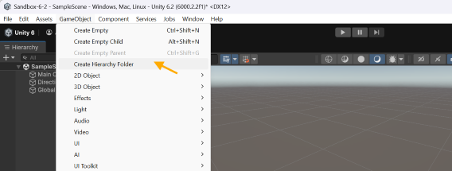
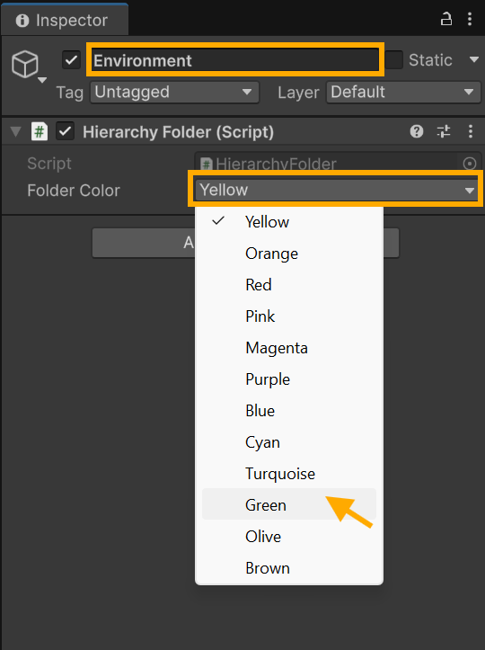
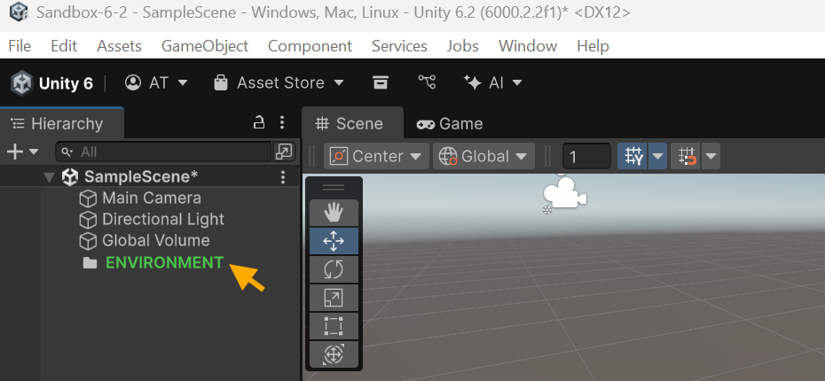
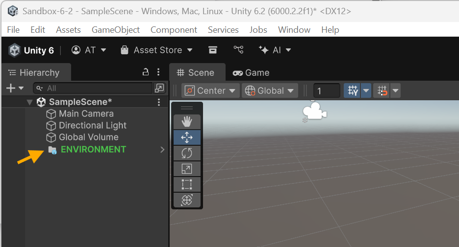

# SimpleUnityHierarchyFolder
Enables the creation of dedicated folder objects in the Unity hierarchy for cleaner, more organized scenes.

Hierarchy Folders are empty GameObjects, but with their transform access removed and represented with a folder icon, making it easy to visually structure large hierarchies.

---

## 📖 About

This Unity package was developed by **[Professor Akram Taghavi-Burris](https://www.linkedin.com/in/akram-taghavi-burris/)** for educational purposes under the **[MIT License](LICENSE)**.

For more information about the use case for this plugin, visit:  
👉 [https://getcreativetoday.com/](https://getcreativetoday.com/)

---

## ✨ Features

- Create dedicated hierarchy folders directly from the Unity menu.
- Clear folder-style visualization:
  - Game object represented by default Unity **folder** icon
  - Colored, all-caps text label
- Hides access to the **transform component**, ensuring the folder game object does not affect the scene layout.
- Folder objects can still be turned into prefabs, with a **prefab overlay icon** displayed to visually indicate prefab status.
---

## 📦 Installation (via GitHub URL)

You can add this package directly to your Unity project using the Unity Package Manager:

1. Open Unity.
2. In the top menu, go to: **`Window` > `Package Manager`**.
3. Click the **`+`** button in the top-left corner.
4. Select **`Add package from Git URL...`**
5. Paste the following URL:  https://github.com/ProfessorAkram/SimpleUnityHierarchyFolder.git

---

## 🚀 Usage

1. In the Unity menu, go to **`GameObject` > `Create Hierarchy Folder`**.
   - Or right-click in the **Hierarchy Window** and choose `Create Hierarchy Folder` from the context menu
   
     
   
2. A new **folder** object will appear in your hierarchy.
3. In the inspector, set the name and *text* color of the folder
   - Choose the text color from the drop-down list of colors.
   
     
   
4. In the **Hierarchy Window**, the folder object will be displayed as shown in the image below:

    

5. If a **folder** is converted to a **prefab**, the folder icon will update with a prefab icon overlay, as shown below:

   

---
## 🎨 Scene Hierarchy Color Scheme

The Hierarchy Folders plugin can be used in any way you choose. Colors can be aesthetic, arbitrary, or tailored to your personal workflow.

That said, I prefer to use color intentionally, assigning each color a specific architectural meaning. The goal is to visually communicate object responsibility at a glance:
-  What controls the game?
-  What exists physically in the world?
-  What does the player interact with?
-  What is temporary or should not be in the build?

When used consistently, the hierarchy becomes a visual map of the game’s structure, not just a list of GameObjects. You should be able to open a scene and quickly understand its organization before inspecting a single component.

The following color scheme reflects that philosophy:

| Category       | Color   | Meaning                                                                                     |
| -------------- | ------- | ------------------------------------------------------------------------------------------- |
| Testing / Temp | Red     | Temporary objects, prototypes, or items that must be reviewed or removed before final build |
| Actors         | Orange  | Player and NPC characters                                                                   |
| Interactables  | Magenta | Player-triggered objects                                                                    |
| Lights         | Yellow  | All lighting objects                                                                        |
| Environment    | Green   | Static world geometry and terrain                                                           |
| Cameras        | Cyan    | Viewing and camera systems                                                                  |
| UI             | Blue    | Interface and canvas roots                                                                  |
| Audio          | Purple  | Scene-based audio emitters                                                                  |
| Managers       | Silver  | Invisible system controllers (GameManager, InputManager, etc.)                              |

---
